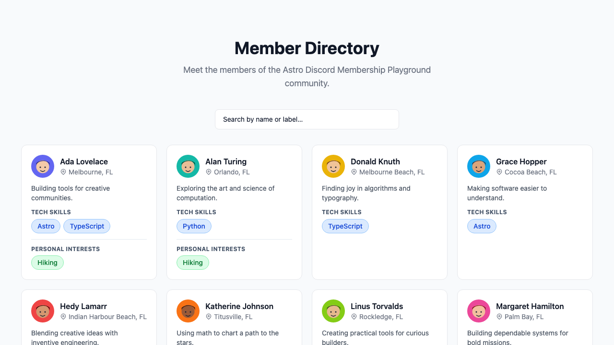
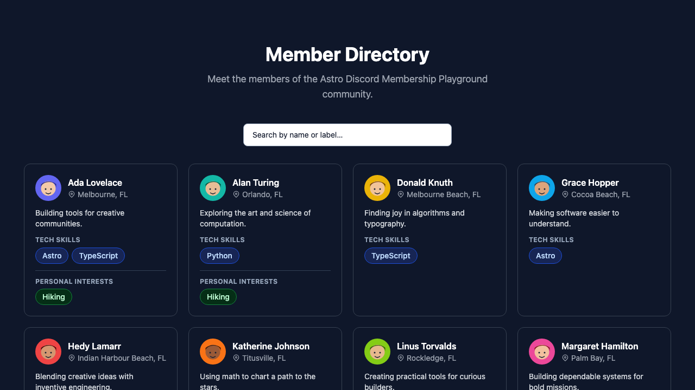
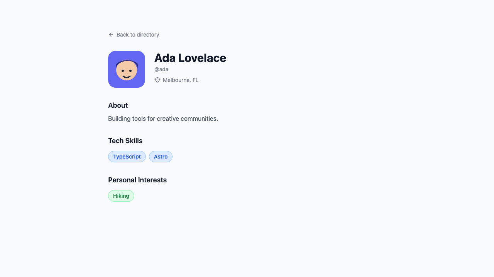
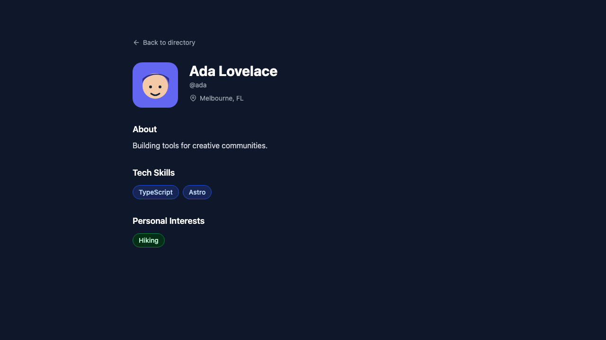
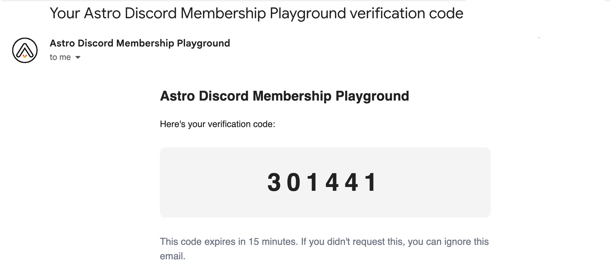
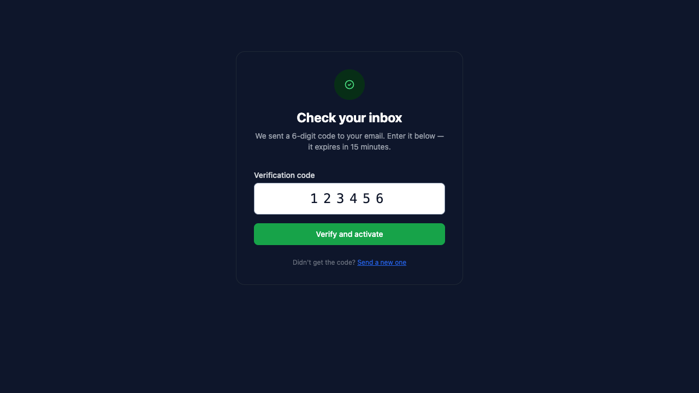

# astro-discord-membership

An Astro integration that adds Discord-based community membership to your site — OAuth login, a member directory, public profiles, and email verification — with storage supplied by your application.

## Screenshots

### Member directory





### Public member profile





### Email verification

Members receive a time-limited six-digit code by email, then enter it to activate their profile.





## Features

- **Discord OAuth** — members sign in with their Discord account
- **Guild gate** — only members of your Discord server can create a profile
- **Member directory** — browseable, searchable public profile listing at `/members`
- **Public profiles** — individual pages at `/members/[username]` with bio, labels, and social links
- **Email verification** — 6-digit code flow at `/verify-email`
- **Profile editor** — members manage their own profile at `/profile`
- **Discord webhook notifications** — optional new-member announcements posted to a channel
- **Drop-in components** — `<LatestMembers>`, `<MemberCard>`, `<MemberSpotlight>`, `<AuthButton>`

## Installation

```bash
npm install @space-coast-devs/astro-discord-membership
```

Add the integration to your `astro.config.ts`:

```ts
import { defineConfig } from 'astro/config';
import membership from '@space-coast-devs/astro-discord-membership';

export default defineConfig({
  output: 'server', // or 'hybrid'; configure the adapter for your deployment platform
  integrations: [
    membership({
      databaseAdapter: './src/membership-database.ts',
      communityName: 'Your Community',
      siteUrl: 'https://yoursite.com',
      styles: true, // Set false when the host app supplies all CSS.
    }),
  ],
});
```

The integration injects server-rendered routes, so the host app must use `server` or `hybrid` output with the adapter appropriate for its deployment target. The package owns its page shell, a small base layer, component styles, and SVG icons. It does not require Tailwind or ship a Tailwind utility stylesheet. Set `styles: false` to inject no CSS and fully style the routes from the host app.

### Publishing releases

This package is published as `@space-coast-devs/astro-discord-membership`. CI validates pull requests and `main`; publishing occurs only when a GitHub Release is published for a matching `vX.Y.Z` tag. A prerelease publishes to npm's `next` tag and a stable release publishes to `latest`.

Before the first release, create a protected GitHub environment named `npm-publish`, then configure npm Trusted Publishing for the package with GitHub organization `SpaceCoastDevs`, repository `astro-discord-membership`, workflow filename `publish.yml`, and environment `npm-publish`. The workflow uses OIDC, so it does not require an `NPM_TOKEN` secret.

### Host-owned Tailwind theme

For a site-specific design, disable the package stylesheet and style the stable semantic hooks from the host app. This keeps Tailwind compilation in the host project: use `@apply` in a host CSS file rather than passing dynamic Tailwind class strings into the integration.

```ts
membership({
  databaseAdapter: './src/membership-database.ts',
  communityName: 'Your Community',
  siteUrl: 'https://yoursite.com',
  styles: false,
});
```

### Build custom pages

The injected routes are convenient defaults. For a custom page, import the data-driven components and arrange them inside your own layout. They do not read the database themselves, so your page controls data loading, authorization, copy, and placement.

```astro
---
import MemberDirectory from '@space-coast-devs/astro-discord-membership/components/MemberDirectory.astro';
import MemberCard from '@space-coast-devs/astro-discord-membership/components/MemberCard.astro';

// Load and authorize data in your own page, then pass it to the component.
const members = await database.listPublicMemberProfiles();
---

<MySiteLayout title="People">
  <MemberDirectory communityName="Space Coast Devs" members={members} />
</MySiteLayout>
```

Available composition components include `MemberDirectory`, `MemberCard`, `PublicMemberProfile`, `ProfileForm`, `LabelPicker`, `AuthButton`, `LatestMembers`, and `MemberSpotlight`. Import them from `@space-coast-devs/astro-discord-membership/components/<Name>.astro`. Pass the optional `viewer` prop to `MemberDirectory` to show the signed-in profile or email-verification call to action.

```css
/* src/styles/membership-theme.css */
@layer components {
  .membership-directory__grid {
    @apply grid grid-cols-1 gap-6 md:grid-cols-2 lg:grid-cols-3;
  }

  .membership-member-card {
    @apply rounded-2xl border border-slate-200 bg-white p-6 shadow-sm;
  }

  .dark .membership-member-card {
    @apply border-slate-700 bg-slate-900;
  }
}
```

Supported hooks:

- Directory: `.membership-directory`, `__header`, `__title`, `__description`, `__search`, `__search-input`, `__grid`, `__empty`, and `__sign-in`.
- Member card: `.membership-member-card`, `__header`, `__avatar`, `__identity`, `__name`, `__location`, `__bio`, `__labels`, `__label-category`, `__label-category-name`, `__label-list`, `__label`, and `__label-more`.
- Public profile: `.membership-member-profile`, `__container`, `__back`, `__identity`, `__avatar`, `__details`, `__name`, `__username`, `__location`, `__social-links`, `__social-link`, `__bio`, `__bio-title`, `__bio-content`, `__label-category`, `__label-category-title`, `__label-list`, and `__label`.
- Profile editor: `.membership-profile`, `__container`, `__header`, `__title`, `__description`, `__status`, `__identity`, `__avatar`, `__identity-details`, `__form`, `__field`, `__label`, `__input`, `__textarea`, `__social-links`, `__label-category`, `__label-option`, `__visibility`, `__actions`, `__save`, `__public-link`, `__footer`, and `__sign-out`.
- Label admin: `.membership-label-admin`, `__container`, `__header`, `__title`, `__description`, `__create-category`, `__import`, `__downloads`, `__category`, `__category-header`, `__category-title`, `__order-form`, `__labels`, `__label`, and `__create-label`.
- Email verification: `.membership-verify-email`, `__container`, `__card`, `__header`, `__icon`, `__title`, `__description`, `__error`, `__form`, `__field`, `__input`, and `__submit`.
- Reusable components: `.membership-auth-button`, `.membership-latest-members`, and `.membership-member-spotlight`, with semantic element classes beneath each component.

### Database adapter

The host app provides a module that default-exports a `MembershipDatabaseAdapter`. This keeps persistence independent of the integration: use the included Firestore adapter, the included Drizzle adapter, or implement the contract yourself.

```ts
// src/membership-database.ts
import { createFirestoreAdapter } from 'astro-discord-membership/adapters/firestore';

export default createFirestoreAdapter();
```

#### Drizzle with SQLite

The playground uses a local SQLite file at `playground/membership.db`, so no database server is required. Install Drizzle, the SQLite driver, and the migration tool:

```bash
npm install drizzle-orm better-sqlite3
npm install -D drizzle-kit dotenv
```

Set `DB_FILE_NAME=./membership.db` in the host app's `.env`, then define the five tables required by the adapter.

```ts
// src/db/schema.ts
import { integer, sqliteTable, text } from 'drizzle-orm/sqlite-core';

export const members = sqliteTable('members', {
  discordId: text('discord_id').primaryKey(),
  discordUsername: text('discord_username').notNull().unique(),
  displayName: text('display_name').notNull(),
  avatarUrl: text('avatar_url').notNull(),
  bio: text('bio').notNull().default(''),
  location: text('location').notNull().default(''),
  website: text('website').notNull().default(''),
  github: text('github').notNull().default(''),
  linkedin: text('linkedin').notNull().default(''),
  bluesky: text('bluesky').notNull().default(''),
  isPublic: integer('is_public', { mode: 'boolean' }).notNull().default(true),
  email: text('email').notNull().default(''),
  emailVerified: integer('email_verified', { mode: 'boolean' }).notNull().default(false),
  announced: integer('announced', { mode: 'boolean' }).notNull().default(false),
  joinedAt: integer('joined_at', { mode: 'timestamp_ms' }).notNull(),
  updatedAt: integer('updated_at', { mode: 'timestamp_ms' }).notNull(),
});

export const labelCategories = sqliteTable('label_categories', {
  id: text('id').primaryKey(),
  name: text('name').notNull(),
  slug: text('slug').notNull().unique(),
  description: text('description'),
  selectionLimit: integer('selection_limit'),
  sortOrder: integer('sort_order').notNull().default(0),
  status: text('status', { enum: ['active', 'archived'] }).notNull().default('active'),
  createdAt: integer('created_at', { mode: 'timestamp_ms' }).notNull(),
  updatedAt: integer('updated_at', { mode: 'timestamp_ms' }).notNull(),
});

export const labels = sqliteTable('labels', {
  id: text('id').primaryKey(),
  categoryId: text('category_id').notNull().references(() => labelCategories.id),
  name: text('name').notNull(),
  slug: text('slug').notNull(),
  group: text('group_name'),
  status: text('status', { enum: ['active', 'pending', 'archived'] }).notNull().default('active'),
  submittedBy: text('submitted_by'),
  createdAt: integer('created_at', { mode: 'timestamp_ms' }).notNull(),
  updatedAt: integer('updated_at', { mode: 'timestamp_ms' }).notNull(),
});

export const labelAssignments = sqliteTable('label_assignments', {
  discordId: text('discord_id').notNull().references(() => members.discordId),
  labelId: text('label_id').notNull().references(() => labels.id),
  createdAt: integer('created_at', { mode: 'timestamp_ms' }).notNull(),
});

export const verifications = sqliteTable('verifications', {
  discordId: text('discord_id').primaryKey(),
  email: text('email').notNull(),
  code: text('code').notNull(),
  expiresAt: integer('expires_at', { mode: 'timestamp_ms' }).notNull(),
  attempts: integer('attempts').notNull().default(0),
  createdAt: integer('created_at', { mode: 'timestamp_ms' }).notNull(),
});
```

Create the Drizzle client:

```ts
// src/db/index.ts
import Database from 'better-sqlite3';
import { drizzle } from 'drizzle-orm/better-sqlite3';

export const db = drizzle(new Database(import.meta.env.DB_FILE_NAME ?? './membership.db'));
```

Configure Drizzle Kit so it can generate and apply the schema migration:

```ts
// drizzle.config.ts
import 'dotenv/config';
import { defineConfig } from 'drizzle-kit';

export default defineConfig({
  schema: './src/db/schema.ts',
  out: './drizzle',
  dialect: 'sqlite',
  dbCredentials: { url: process.env.DB_FILE_NAME ?? './membership.db' },
});
```

Then default-export the adapter from the module named in `databaseAdapter`:

```ts
// src/membership-database.ts
import { createDrizzleAdapter } from 'astro-discord-membership/adapters/drizzle';
import { db } from './db';
import { labelAssignments, labelCategories, labels, members, verifications } from './db/schema';

export default createDrizzleAdapter(db, { members, labelCategories, labels, labelAssignments, verifications });
```

For the playground, initialize the local database with:

```bash
cd playground
pnpm db:push
```

`db:push` creates or updates `membership.db`. For versioned migrations, use `pnpm db:generate` followed by `pnpm db:migrate` instead.

The full TypeScript contract is exported from `astro-discord-membership/types`. The Firestore and Drizzle packages are optional peer dependencies; install only the adapter you use.

Add path aliases to your `tsconfig.json` so imports resolve correctly:

```json
{
  "compilerOptions": {
    "paths": {
      "#membership": ["node_modules/astro-discord-membership/index.ts"],
      "#membership/*": ["node_modules/astro-discord-membership/*"],
      "astro-discord-membership:config": ["node_modules/astro-discord-membership/types.d.ts"]
    }
  }
}
```

## Discord App Setup

1. Go to the [Discord Developer Portal](https://discord.com/developers/applications) and create a new application
2. Under **OAuth2**, add a redirect URI matching `DISCORD_REDIRECT_URI`
3. Copy the **Client ID** and **Client Secret** into your `.env`
4. Enable the `identify` and `guilds` OAuth2 scopes (the integration requests these automatically)

## Options

| Option            | Type     | Default          | Description                                                                 |
|-------------------|----------|------------------|-----------------------------------------------------------------------------|
| `databaseAdapter` | `string` | —                | Required module path that default-exports a `MembershipDatabaseAdapter`.    |
| `communityName`   | `string` | `"My Community"` | Display name used in page titles, email subjects, and Discord notifications |
| `siteUrl`         | `string` | `""`             | Public root URL of your site (no trailing slash). Used in Discord embeds.   |

## Environment Variables

Create a `.env` file in your project with the following variables:

### Discord OAuth

| Variable                     | Description                                                                                        |
|------------------------------|----------------------------------------------------------------------------------------------------|
| `DISCORD_CLIENT_ID`          | OAuth2 application client ID from the Discord Developer Portal                                     |
| `DISCORD_CLIENT_SECRET`      | OAuth2 application client secret                                                                   |
| `DISCORD_REDIRECT_URI`       | Must match the redirect URI set in your Discord app, e.g. `https://yoursite.com/api/auth/callback` |
| `DISCORD_GUILD_ID`           | ID of the Discord server users must be a member of                                                 |
| `DISCORD_NOTIFY_WEBHOOK_URL` | *(optional)* Webhook URL to post new-member announcements                                          |


#### To find your Guild ID:

1. Open Discord and go to **User Settings → Advanced**, then enable **Developer Mode**
2. Right-click your server name in the left sidebar
3. Click **Copy Server ID** — that is your Guild ID


#### To create a webhook URL:

1. Open your Discord server and go to the channel where you want new-member notifications posted
2. Click the **gear icon** next to the channel name to open Channel Settings
3. Go to **Integrations → Webhooks → New Webhook**
4. Give it a name (e.g. "New Members") and optionally set an avatar
5. Click **Copy Webhook URL** and paste it as `DISCORD_NOTIFY_WEBHOOK_URL` in your `.env`

If `DISCORD_NOTIFY_WEBHOOK_URL` is not set, notifications are silently skipped — no error is thrown.

### Firebase (Firestore adapter only)

| Variable                | Description                                                                                           |
|-------------------------|-------------------------------------------------------------------------------------------------------|
| `FIREBASE_PROJECT_ID`   | Firebase project ID (used by the included Firestore adapter)                                          |
| `FIREBASE_CLIENT_EMAIL` | Service account client email                                                                          |
| `FIREBASE_PRIVATE_KEY`  | Service account private key. If hosted on Netlify, literal `\n` characters are handled automatically. |
| `FIREBASE_DATABASE_ID`  | *(optional)* Firestore database ID. Defaults to `(default)`.                                          |

### Drizzle (SQLite example)

| Variable       | Description                                                                 |
|----------------|-----------------------------------------------------------------------------|
| `DB_FILE_NAME` | Local SQLite file used by the Drizzle client, e.g. `./membership.db`.      |

### Session

| Variable         | Description                                    |
|------------------|------------------------------------------------|
| `SESSION_SECRET` | A long random string used to sign session JWTs |

Generate a secure value with either of these commands:

```bash
# Node.js
node -e "console.log(require('crypto').randomBytes(32).toString('hex'))"

# openssl (macOS / Linux)
openssl rand -hex 32
```

### Email (SMTP)

| Variable        | Description                                                        |
|-----------------|--------------------------------------------------------------------|
| `SMTP_HOST`     | SMTP server hostname, e.g. `smtp.gmail.com` or `smtp.mailgun.org` |
| `SMTP_PORT`     | SMTP server port. Defaults to `587`                                |
| `SMTP_SECURE`   | Set to `true` for port 465 (TLS). Omit or `false` for STARTTLS    |
| `SMTP_USER`     | SMTP auth username / sending address                               |
| `SMTP_PASSWORD` | SMTP auth password or app password                                 |

## Injected Routes

The integration automatically registers the following server-rendered routes:

| Route                              | Description                          |
|------------------------------------|--------------------------------------|
| `GET /api/auth/login`              | Initiates Discord OAuth flow         |
| `GET /api/auth/callback`           | OAuth callback handler               |
| `GET /api/auth/logout`             | Clears session cookies               |
| `POST /api/auth/send-verification` | Sends email verification code        |
| `POST /api/auth/verify-code`       | Validates the submitted code         |
| `GET/PATCH /api/profile`           | Reads and updates the member profile |
| `GET /members`                     | Member directory page                |
| `GET /members/[username]`          | Individual member profile page       |
| `GET /profile`                     | Member profile editor                |
| `GET /verify-email`                | Email entry page                     |
| `GET /verify-email/check`          | Verification code entry page         |

## Components

Import components using the `#membership` alias:

```astro
---
import LatestMembers from '#membership/components/LatestMembers.astro';
import AuthButton from '#membership/components/AuthButton.astro';
import MemberCard from '#membership/components/MemberCard.astro';
import MemberSpotlight from '#membership/components/MemberSpotlight.astro';
---
```

### `<LatestMembers>`

Displays a grid of recently joined members.

```astro
<LatestMembers count={6} id="members-section" isDark={false} />
```

| Prop     | Type      | Default | Description                        |
|----------|-----------|---------|------------------------------------|
| `count`  | `number`  | `6`     | Number of members to display       |
| `id`     | `string`  | —       | Optional HTML `id` for the section |
| `isDark` | `boolean` | `false` | Render on a dark background        |

### `<AuthButton>`

Renders a "Sign in with Discord" button or the signed-in user's avatar, driven by a session cookie. Hydrates automatically on page load and after View Transitions navigations.

```astro
<AuthButton />
```

## Firebase Setup

1. Create a Firebase project at [console.firebase.google.com](https://console.firebase.google.com)
2. Enable **Firestore** in Native mode
3. Create a **Service Account** (Project Settings → Service Accounts → Generate new private key)
4. Copy the `project_id`, `client_email`, and `private_key` values into your `.env`

The included Firestore adapter expects four Firestore collections:

- `members` — one document per user, keyed by Discord user ID
- `labelCategories` — active and archived label categories
- `labels` — the labels available within a category
- `labelAssignments` — one document per member-to-label assignment

## License

MIT
